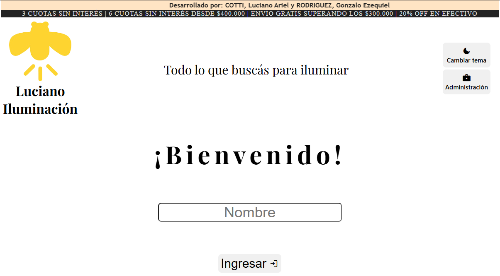
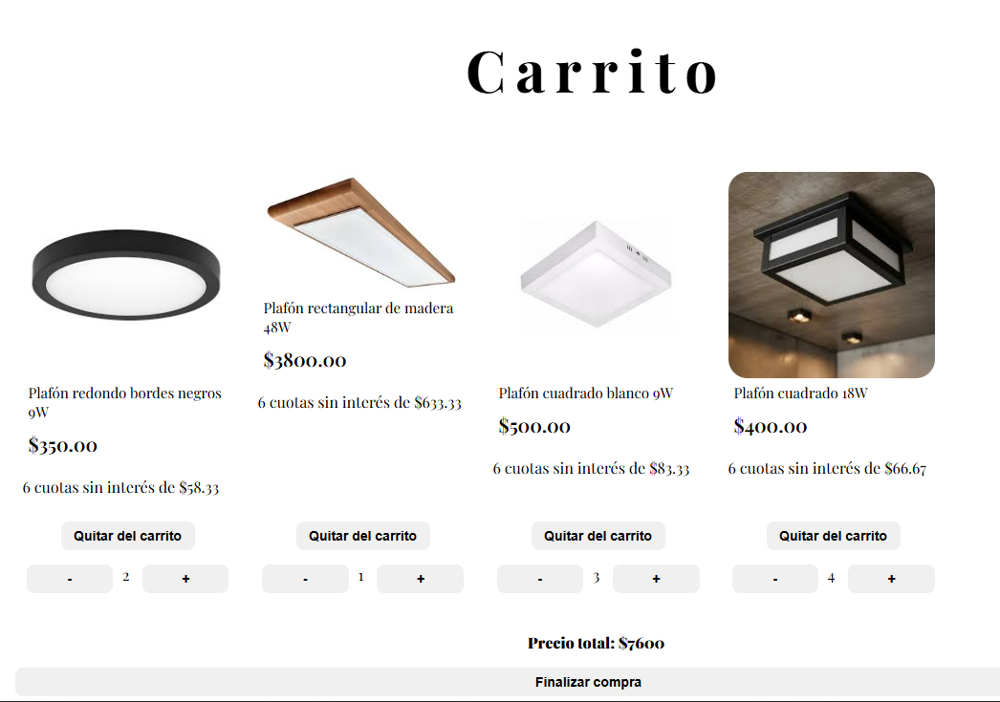
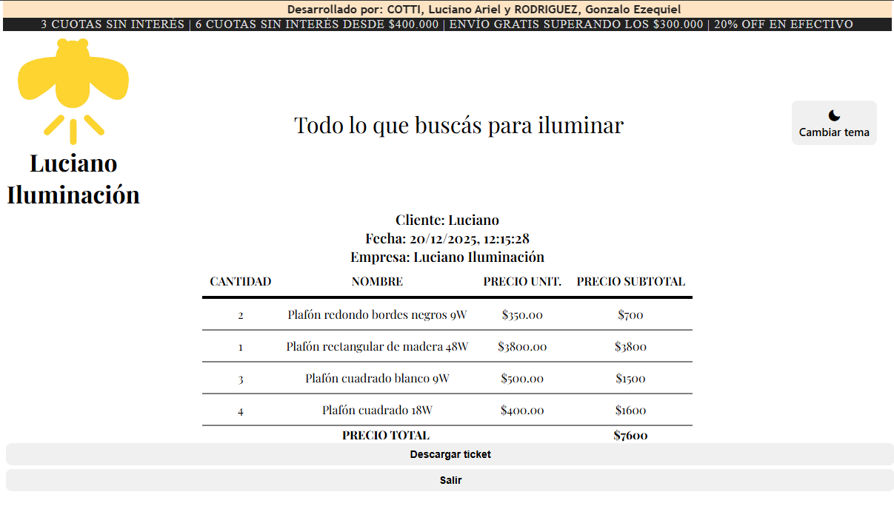
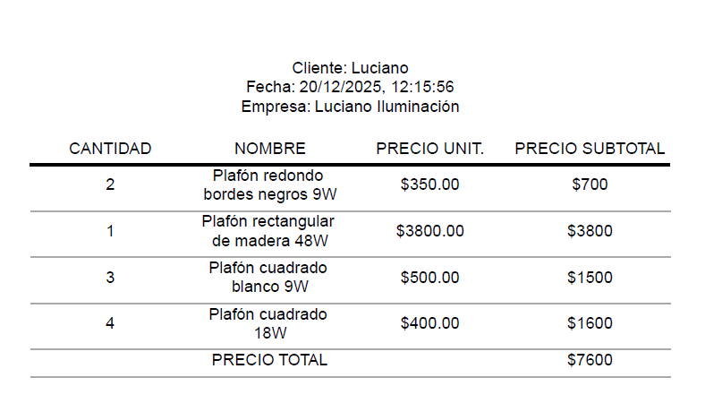
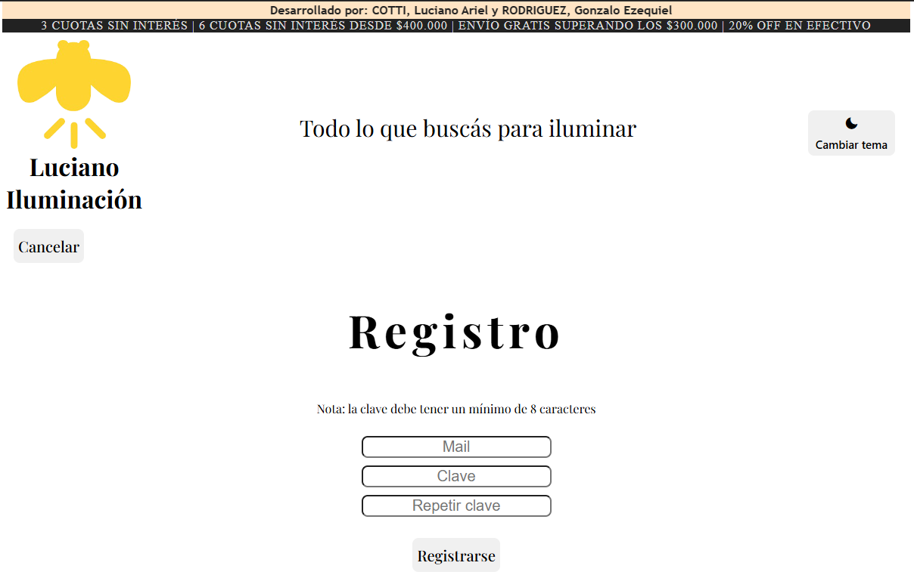
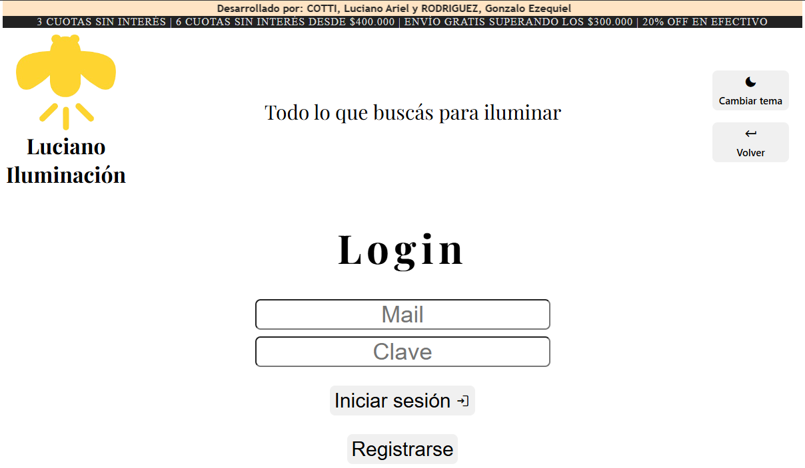
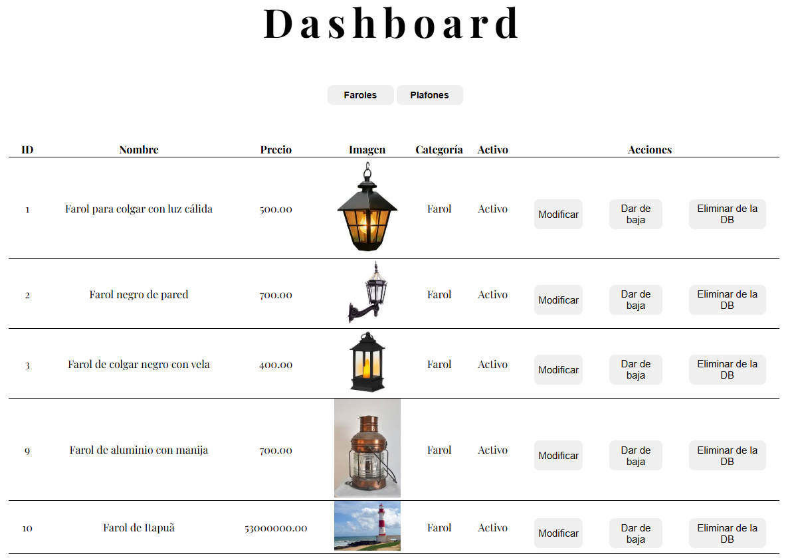
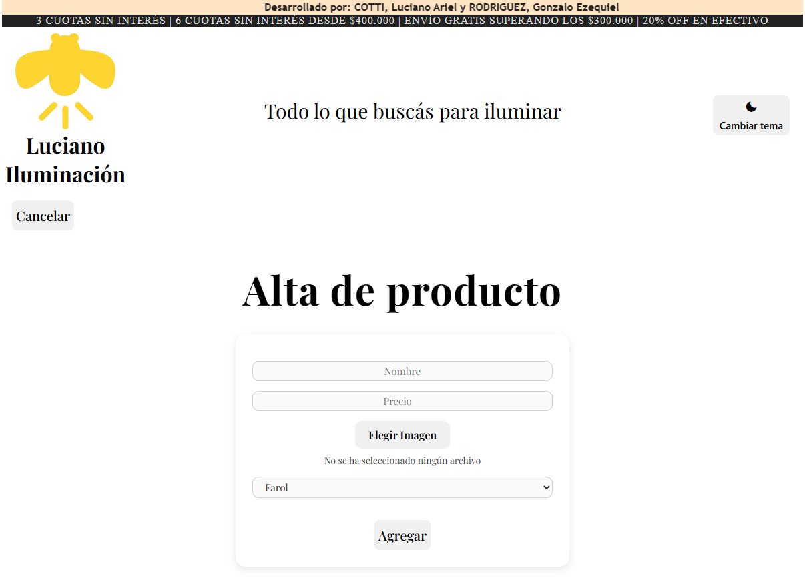
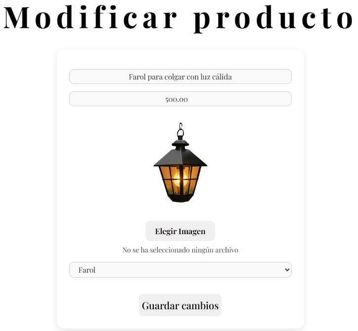

# Sistema de Autoservicio

Aplicación web full stack para realizar pedidos mediante un sistema de autoservicio.

## Funcionalidades

- Panel de cliente:
  - Visualización de productos
  - Creación de pedidos
  - Descarga de ticket en PDF
- Panel de administrador:
  - Inicio de sesión
  - Visualización, creación, modificación y eliminación de productos

## Tecnologías

- HTML
- CSS
- JavaScript
- Node.js
- Express
- EJS
- bcrypt
- zod
- multer
- pdfkit
- sequelize
- Base de datos MySQL
- Live Server (extensión de Visual Studio Code)

## Capturas de pantalla

### Cliente

#### Bienvenida


#### Productos


#### Carrito


#### Ticket en Web


#### Ticket en PDF


### Administración

#### Registro



#### Login


#### Dashboard


#### Alta de Producto


#### Modificación de Producto


## Arquitectura

La aplicación está separada en dos partes:

- **Backend**: servidor Node.js con Express que expone la lógica de negocio y acceso a la base de datos.
- **Frontend**: aplicación web estática (HTML, CSS y JavaScript) que se ejecuta mediante Live Server.

## Instalación

1. Clonar el repositorio.
2. Crear una base de datos MySQL local.
3. Abrir en consola la carpeta `/back`.
4. Instalar las dependencias ejecutando `npm install`.
5. Crear el archivo `.env` y configurar la cadena de conexión a la base de datos utilizando el nombre `STRING_DB`.
6. Crear la carpeta `/uploads` para subida de imágenes.

## Ejecución

### Backend

Desde la carpeta `/back` ejecutar:

- Modo desarrollo:
```bash
npm run dev
```
- Modo estándar:
```bash
npm start
```

### Frontend

1. Abrir la carpeta `/front` en el Visual Studio Code.
2. Click derecho en el archivo `/views/bienvenida.html` y seleccionar la opción **Open with Live Server** (es necesario tener instalada la extensión **Live Server**).

> Importante: el backend debe estar en ejecución antes de abrir el frontend con Live Server, ya que el frontend consume la API expuesta por el servidor Express.
